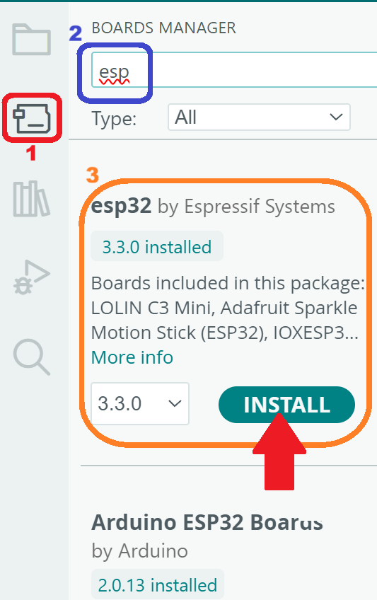

# Ejercicio 1: Hola mundo!
El primer objetivo de esta práctica es la configuración del IDE de Arduino para su correcto funcionamiento con el dispositivo [T-embed](https://lilygo.cc/products/t-embed) y la impresión del mensaje *"HOLA MUNDO"* en la consola del mismo.

El primer paso es la descarga e instalación del **IDE Arduino 2.x**, esto puede realizarse desde el siguiente [enlace](https://www.arduino.cc/en/software/).

Una vez instalado el IDE, es necesario configurarlo para su funcionamiento con el microcontrolador ESP32 del T-embed.

En primer lugar debe seleccionarse el $${\color{red}gestor\space de\space placas\space (Board\space manager)}$$, una vez seleccionado se escribe *"ESP"* en el $${\color{blue}cuadro\space de\space texto}$$ y se pulsa el botón de $${\color{orange}instalación\space (INSTALL)}$$.
> Observe que es posible elegir distintas versiones de una misma placa. En la imagen inferior puede verse que se va a proceder a la instalación de la versión 3.3.0.

Una vez realizadas las operaciones anteriormente descritas es necesaria la configuración del dispostivo, para ello inserte conecte el T-embed al PC haciendo uso del cable USB incluido en la caja. Una vez conectado seleccione la opción **Tools** en el menú superior y proceda a configurar todas la copciones como se observa en la imagen inferior.

> Observe que aunque no se encuentra en la imagen, en el campo **Port** debe seleccionar el puerto serie al que ha conectado el dispositivo. En condidiones normales sólo le aparecerá un único puerto. 

Una vez realizados todos los pasos anteriormente descritos, se está en disposición de comenzar a programar. En este caso se va a programar el dispositivo haciendo uso del lenguaje Arduino, si presta atención podrá encontrar una gran cantidad de similitudes con los lenguajes estudiados durante la asignatura.

Todo programa de arduino consta de al menos dos funciones: **setup** y **loop**. La primera se ejecuta una única vez y posteriormente se procede a ejecutar la segunda de forma iterativa e ininterrumpida. Por este motivo, la función **setup** se utiliza para la configuración inicial de los dispositivos: tamaño de pantalla, color inicial de los LEDs, velocidad de comunicación, etc.

En este primer programa se puede ver como en la función **setup** se abre el puerto serie para la comunicación del dispositivo con el PC a una velocidad de 115200 bits por segundo. Posteriormente se espera un total de 5000ms (5s) y se imprime *HOLA MUNDO!* en la consola. La función **loop* únicamente espera sin hacer nada.

Una vez copiado el código proporcionado, presione sobre el botón **Upload** para enviar el programa al dispositivo y pulse sobre **Serial Monitor** para poder ver la frase que el dispositivo enviará al PC.

Observe el comportamiento del programa, familiarícese con la interfaz y a continuación pruebe a realizar los ejercicios propuestos.
## Ejercicios propuestos
- Modifique el programa para que en lugar de esperar 5 segundos antes de imprimir el mensaje espere 10s.
- Modifique el programa para que en lugar de escribir el mensaje una sola vez el mensaje lo haga cada 5 segundos.
