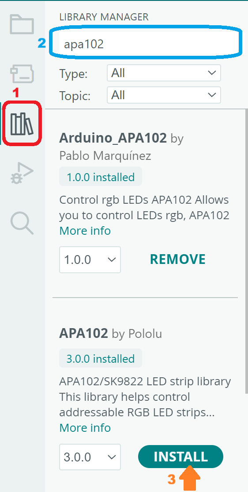

# Ejercicio 2: Uso de los LEDs integrados
Esta práctica tiene como objetivo que el alumno se familiarice con el uso de los leds integrados en el dispositivo.

El dispositivo incluye 7 diodos LEDs RGB configurables mediante [SPI](https://www.digikey.es/es/articles/why-how-to-use-serial-peripheral-interface-simplify-connections-between-multiple-devices) a traves del controlador [APA102](https://cdn-learn.adafruit.com/assets/assets/000/084/591/original/APA102_LED.pdf?1574117503).
Para simplificar el uso y configuración de estos LEDs, se va a hacer uso de la librería APA102. Para instalar dicha librería debe hacer click sobre el $${\color{red}gestor\space de\space librerias\space (Library\space manager)}$$, una vez seleccionado se escribe *"APA102"* en el $${\color{blue}cuadro\space de\space texto}$$ se selecciona la librería **APA102 by Pololu** y se pulsa el botón de $${\color{orange}instalación\space (INSTALL)}$$.
> Observe que existe más de una librería por lo que en habría que estudiar cuáles de ellas son compatibles con su dispositivo y/o se adecúa mejor a sus necesidades.

Una vez realizada la instalación de la librería el primer paso es importarla para poder hacer uso de ella en su programa. Posteriormente se debe crear un objeto de tipo APA102 que será el encargado de gestionar la funcionalidad de los LEDs. Para ello, necesita que se le indiquen a qué pines están conectados los LEDs. Puede consultar dicha información en la [web del fabricante del dispositivo](https://lilygo.cc/products/t-embed).

En este caso, puede comprobar que son los pines 45 y 42 para las señales CLK y DI respectivamente.
> Aunque en este caso se le han proporcionado los pines, debe acostumbrarse a mirar dichas especificaciones en la documentación proporcionada por el fabricante ya que esto podría cambiar entre versiones. De hecho, existen 3 versiones de T-embed y alguna de ellas ¡ni siquiera usa los LEDs APA102!

Una vez creado dicho objeto, es necesario indicar el número de LEDs a controlar y el color que se asociará a cada uno de ellos.
Antes de seguir, debe saber que este dispositivo cuenta con un pin que controla la alimentación de los LEDs y la pantalla. Este pin llamado *POWER ON* se encuentra conectado al pin 46 y debe ponerse a **1** para poder hacer uso de los LEDs o la pantalla. Esto se hace como medida de ahorro. Ambos dispositivos pueden consumir potencialmente mucha energía y no siempre son necesarios.

En la función **setup** únicamente es necesario habilitar los LEDs. Para ello se configura el pin 46 como una salida digital (tomará el valor 0 o 1) y se le fuerza un valor alto (1).

La funcion **loop** simplemente se encarga de asignar un color a cada LED y posteriormente enviar esta información a los mismos.
Observe el comportamiento del programa, familiricese con la interfaz y a continuación pruebe a realizar los ejercicios propuestos.
## Ejercicios propuestos
- Modifique el color de los LEDs.
- Modifique el programa para que el color de los LEDs vaya cambiando según pasa el tiempo.
- Modifique el programa para que cada LED tenga un color diferente.
- Modifique el programa para que cada LED tenga un color diferente y que vaya cambiando según pasa el tiempo.
- Modifique o elimine el tiempo de espera (delay) y observe el comportamiento del dispositivo.
## Ejercicios de profundización
- Abra el [enlace porporcionado](https://cdn-learn.adafruit.com/assets/assets/000/084/591/original/APA102_LED.pdf?1574117503) y estudie el comportamiento del controlador APA102. ¿Sería posible controlar más LEDs?, ¿Existe algún límite a la cantidad?Si existe, ¿qué factores lo limitan?
- Consulte la [guía de referencia de la librería APA102](https://github.com/pololu/apa102-arduino), investigue las posibilidades que ofrece e intente nuevos retos.
