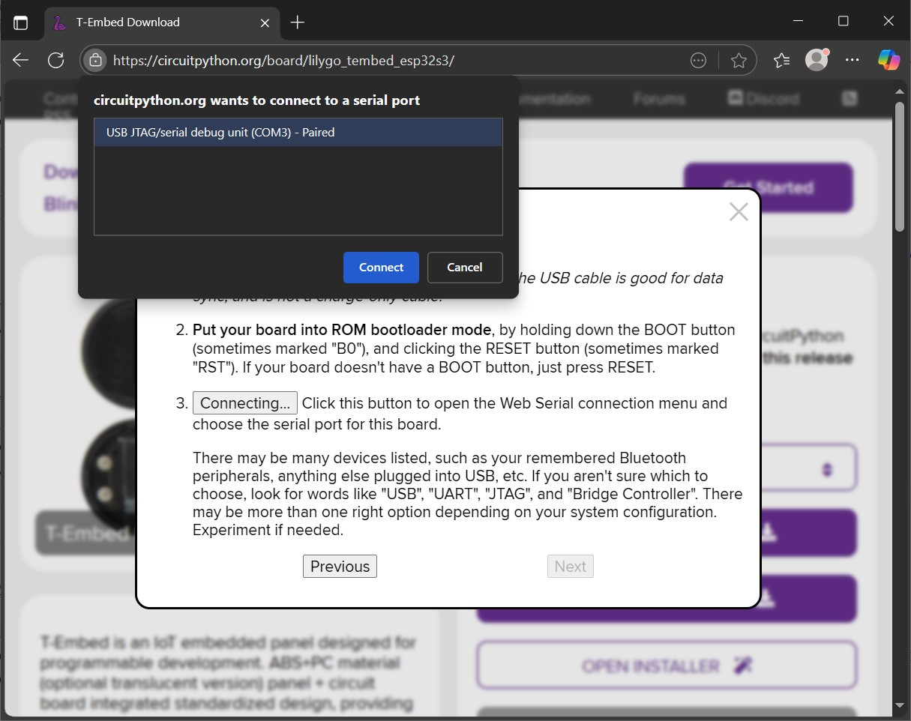
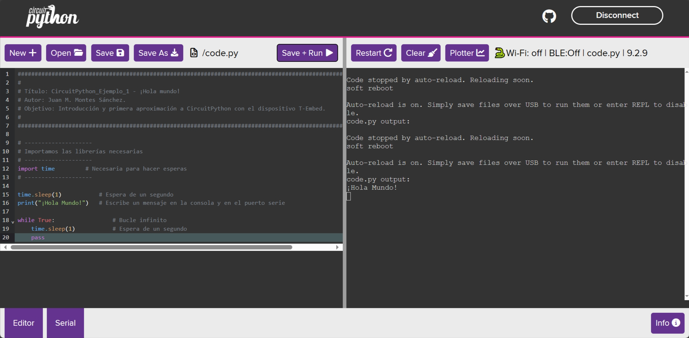

# Ejercicio 1: ¡Hola mundo!
El dispositivo [T-embed](https://lilygo.cc/products/t-embed) es también compatible con el entorno [CircuitPython](https://learn.adafruit.com/welcome-to-circuitpython). En este ejercicio se realizan los pasos necesarios para instalar el entorno y luego ejecutar código de ejemplo **CircuitPython** en el dispositivo T-embed.

## Instalación
En primer lugar se debe acceder al apartado de descargas del dispositivo T-embed en la web oficial de CircuitPython en el siguiente [enlace](https://circuitpython.org/board/lilygo_tembed_esp32s3/). 

>La web de CircuitPython nos permite hacer la configuración inicial y la programación del dispositivo directamente desde nuestro navegador, pero es importante que el navegador que se use para acceder esté basado en Chromium. Por ejemplo, **Microsoft Edge**, **Google Chrome**, **Opera** o **Brave** son compatibles, mientras que **Mozilla Firefox no está soportado**. Si estás en un sistema Windows ya tendrás instalado el navegador Edge.

Se usará el instalador guiado. Para ello, hay que hacer click en el botón *OPEN INSTALLER* situado a la derecha. Esta guía se ha hecho con la versión **CircuitPython 9.2.9**. Se abrirá una ventana y realizaremos los siguientes pasos:
1. Seleccionar *Install CircuitPython 9.2.9 Bin Only* y después hacer click en el botón *Next*.
2. Enchufar la placa por USB al ordenador.
3. Poner la placa en modo *bootloader* siguiendo esta secuencia:
	1. Pulsar el botón del centro de la rueda.
	2. Sin soltarlo, pulsar el botón RST (arriba a la derecha, en un lateral).
	3. Soltar RST primero y luego soltar el botón del centro.
	4. Ya estaría en modo bootloader (mediante serial COM).
4. Hacer click en el botón *Connect*. Aparecerá una ventana del navegador y debe aparecer en el listado un dispositivo COM virtual de nombre *USB Jtag/serial debug unit*.

5. La herramienta pregunta si es necesario hacer un borrado previo. Seleccionar *Continue* para aceptar el borrado.
6. Esperar a que el proceso de borrado e instalación termine. Si todo ha ido bien, aparecerá un mensaje de *Successfully Completed*.
7. Para entrar en modo CircuitPython hay que salir del modo *bootloader* pulsando el botón RST o desconectando y volviendo a conectar el cable USB. 

## Trabajando con CircuitPython
A partir de ahora, en la pantalla del dispositivo veremos los mensajes de información de la consola, en texto blanco sobre fondo negro. En la parte alta está el estado del Wi-Fi, el Bluetooth (BLE) y la versión de CircuitPython (9.2.9 para esta guía). 

Además, la placa T-Embed se listará en el sistema igual que una memoria USB con el nombre CIRCUITPY. Desde el explorador de archivos podemos ver qué contiene el dispositivo.

>Si abrimos la ruta veremos que el dispositivo T-Embed contiene varios archivos, entre ellos uno llamado *code.py* con un programa de ejemplo que muestra por consola el mensaje *Hello World!*. ¡Este programa de Python solo contiene una única línea de código! ¿Recuerdas cuántas líneas hacían falta en Arduino?

No hay que instalar ninguna aplicación en el ordenador para programar en CircuitPython: se puede usar el editor de código web de CircuitPython accediendo al siguiente [enlace](https://code.circuitpython.org/).

Una vez en la web del editor hay que seleccionar USB como método de conexión, y seleccionar en la ventana el dispositivo COM correspondiente a T-Embed.

Después, hay que seleccionar la carpeta de trabajo. Esta carpeta será el dispositivo CIRCUITPY que aparece listado en el explorador de archivos. Hay que permitir el acceso a la carpeta en el mensaje del navegador.

La interfaz del editor web está dividida en dos: a la izquierda tendremos el editor de código, y a la derecha la consola de salida. A diferencia de Arduino, con CircuitPython se puede ejecutar código línea a línea desde la consola.

>Prueba a hacer operaciones matemáticas sencillas escribiendo en la consola, en la derecha. Al pulsar Enter se enviará y ejecutará el código. Algunos ejemplos: Sumas (2+2), restas (2-1), multiplicaciones (2\*2) o divisiones (10/2). El resultado lo calculará el dispositivo T-Embed y lo mostrará en su pantalla y en la consola al mismo tiempo.

En la izquierda, pulsando el botón *Open* se puede acceder al archivo *code.py*. Modifícalo con el código de ejemplo de este ejercicio ([T-Embed-CP-Ej1.py](T-Embed-CP-Ej1.py)) y ejecútalo con el botón *Save+Run*.

>Por defecto, en CircuitPython el archivo de código con nombre *code.py* se ejecutará nada más encenderse el dispositivo de manera automática.

## Ejercicios propuestos
- Modifique el programa para que en lugar de esperar 1 segundo antes de imprimir el mensaje espere 5 segundos.
- Modifique el programa para que en lugar de escribir el mensaje una sola vez el mensaje lo haga cada 5 segundos.
